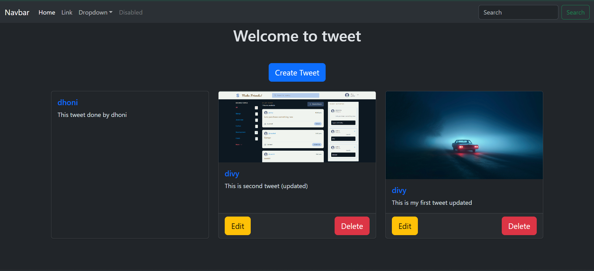
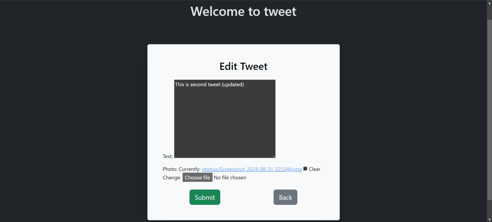

# Tweet App

This is a simple Tweet application built using Django with Bootstrap 5 for frontend styling. Users can create, view, edit, and delete tweets with optional image attachments.

## Features

- **Create Tweet**: Users can create tweets with text and optional images.
- **List Tweets**: Displays all tweets with images, if available.
- **Edit Tweet**: Users can edit their existing tweets.
- **Delete Tweet**: Users can delete their tweets.
- **Responsive Design**: Bootstrap 5 has been used to make the app mobile-friendly and visually appealing.

## Screenshots

### Home Page


### Create/Edit Tweet


### Delete tweet


## Installation

1. **Clone the repository**:

   ```bash
   git clone https://github.com/yourusername/tweet-app.git
2. **Navigate to the project directory**:
   ```bash
   cd tweet-app
3. **Install the required dependencies**:
   ```bash
   pip install -r requirements.txt
4. **Migrate the database**:
   ```bash
   python manage.py migrate
5. **Run the development server**:
   ```bash
   python manage.py runserver
